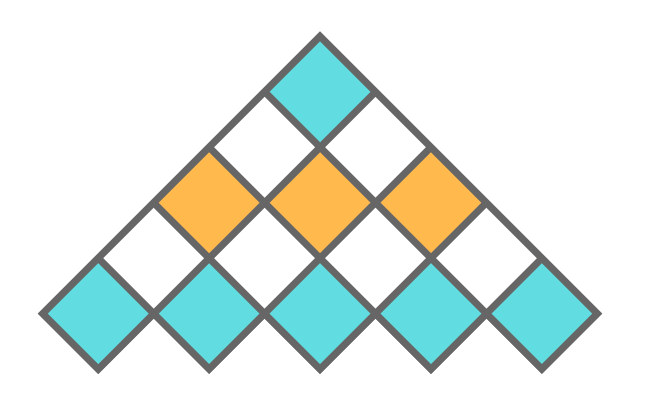

<h1 align="center">Hi 👋, I'm Rahul</h1>
<h3 align="center">An Undergraduate Student, Always keen to Learn New Technologies</h3>

  

  

- 🔭 I’m currently working on `Java` and `Servlet`

- 🌱 I’m currently learning `DSA` and `Docker`

- 💬 Ask me about `Java, C, C++, DSA`

- ❤️ Currently contributing to `Open-Source`

 <h2><i>Coding Profiles</h2>
   

 
  
  
 

  
  

<h3 align="left">Languages and Tools:</h3>

### 🛠️ My Project

&nbsp;

